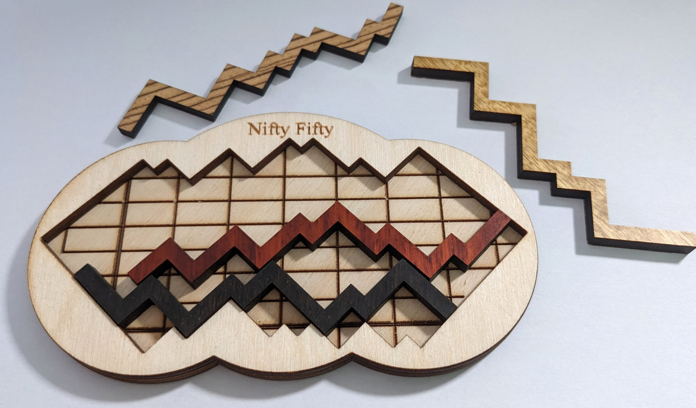

# Solver for a wooden puzzle called "Nifty Fifty"

This year, we got a pretty tough puzzle for Christmas called "Nifty Fifty".
It consists of a base platform with an inset where you have to place 4 wooden pieces
of different shapes and sizes.
As you can imagine, it's easy to get 3 of them in but really hard to place the fourth one.
In fact, the person who gifted this specifically asked for the hardest puzzle they have.



If you ignore the grid-lines on the background of the inset, there was a slight chance that 
the solution was that the pieces actually line up with the outline of the inset.
If this is the case, you can write an algorithm that goes through all possible combinations
of how to place pieces on the board.

## Implementation

This implementation uses Kotlin for going through the possibility-tree and storing found solutions.
As it turns out, there is exactly one unique solution for the puzzle.
The solution can be visualized by running the Desktop Compose Gradle task.

## Running

Clone or download this repository and run it with

```shell
./gradlew run
```

## Tooling

For the best experience, open the project in IntelliJ IDEA. Either the community edition or the
Ultimate edition is fine.